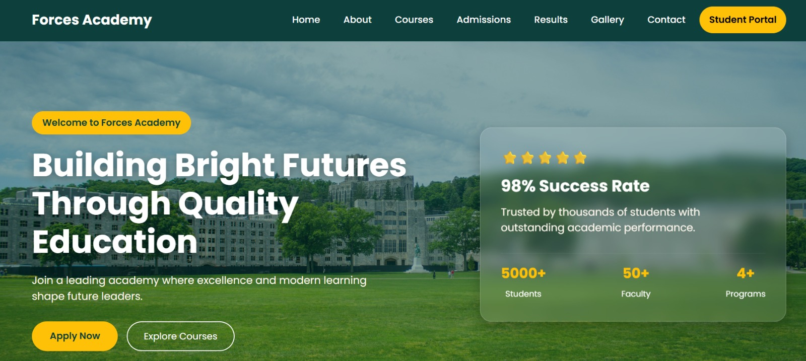
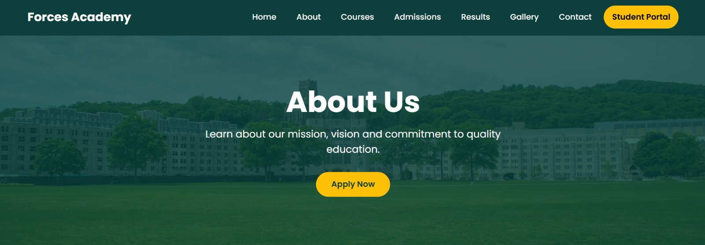
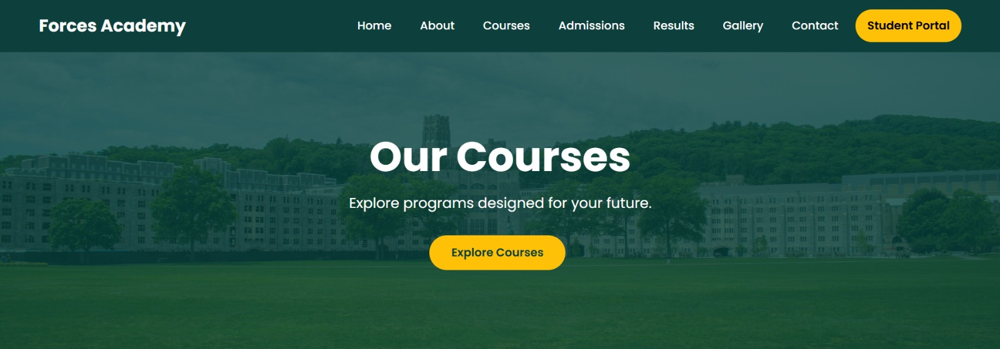
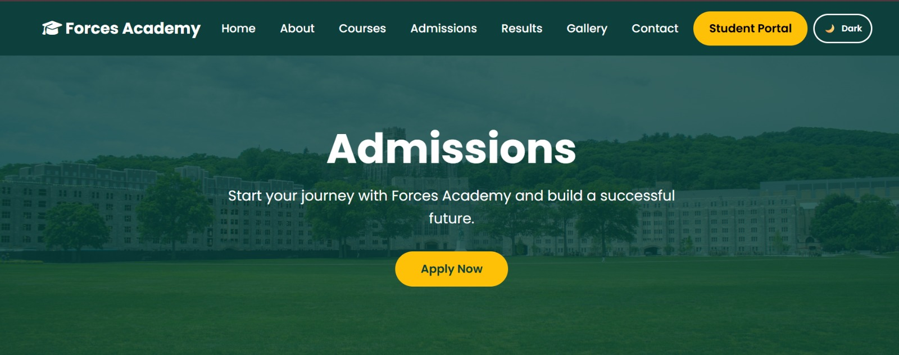

# 🎓 Forces Academy Frontend Website

A modern, responsive, and user-friendly frontend website developed for **Forces Academy** as part of the **Code Saviours Summer Internship SI-26 (2026)**.

This project was built using HTML5, CSS3, Bootstrap 5, and JavaScript. It provides an attractive and responsive interface for students to explore academy information, courses, admissions, results, gallery, and contact details.

# Live Website

🔗 https://hayyamamir.github.io/forces-academy-frontend-codesaviours-si26-hayyam/

# GitHub Repository

🔗 https://github.com/HayyamAmir/forces-academy-frontend-codesaviours-si26-hayyam

# Screenshots

## Home Page

## About Page

## Courses Page

## Admissions Page

# Tech Stack

- HTML5
- CSS3
- Bootstrap 5
- JavaScript
- Bootstrap Icons
- Google Fonts (Poppins)
- EmailJS
- Git & GitHub
- GitHub Pages
  
# Features

- Responsive Design
- Modern Hero Section
- Professional Navigation Bar
- About Page
- Courses Page
- Admissions Page
- Results Page
- Gallery Page
- Contact Page
- Contact Form Validation
- Google Maps Integration
- FAQ Section
- Testimonial Slider
- Animated Statistics
- Back to Top Button
- Mobile Friendly Layout
- - Dark/Light Mode
- Smooth Animations
- Admission Enquiry Form with EmailJS
- Student Portal Integration
- Latest Announcements
- SEO Meta Information
- Favicon
- Image Alt Text for Accessibility
- Clean UI/UX Design

# Pages Included

- Home
- About
- Courses
- Admissions
- Results
- Gallery
- Contact

#  How to Run

1. Clone this repository.
2. Open the project folder.
3. Run **index.html** in your browser.

# Built By

 Hayyam Amir | Code Saviours SI-26 | 2026
